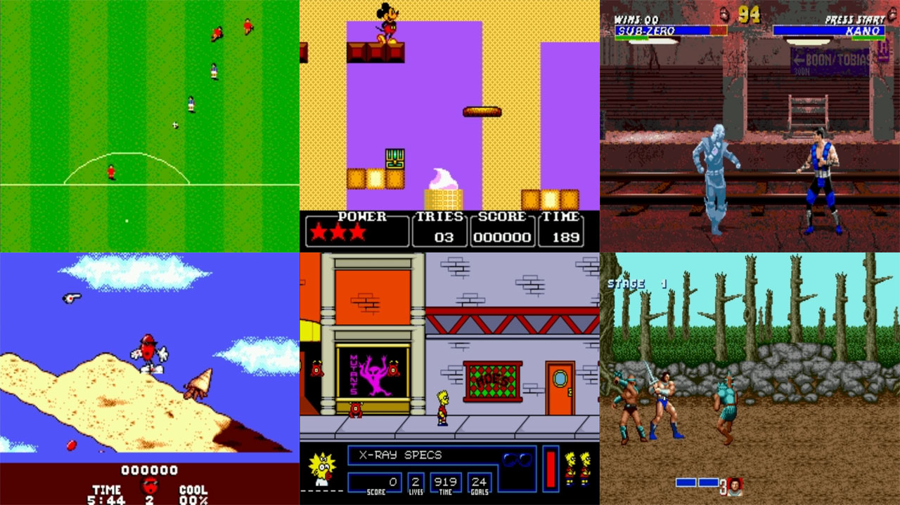
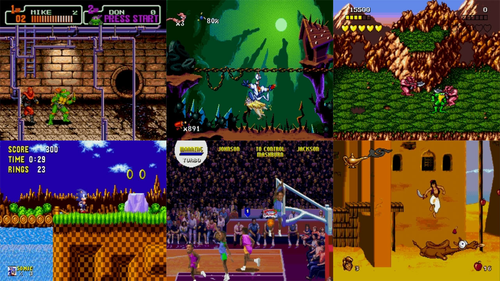
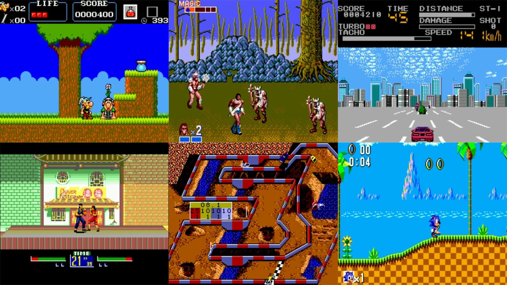

# Sega - MS/GG/MD/CD/32X (BlastEm)

### Description

BlastEm is an open source, higly accurate emulator for the Genesis/Megadrive that runs on modest hardware.

### License

GPLv3

### Icon

### Fanart

Help make me fanart!

### Screenshots

